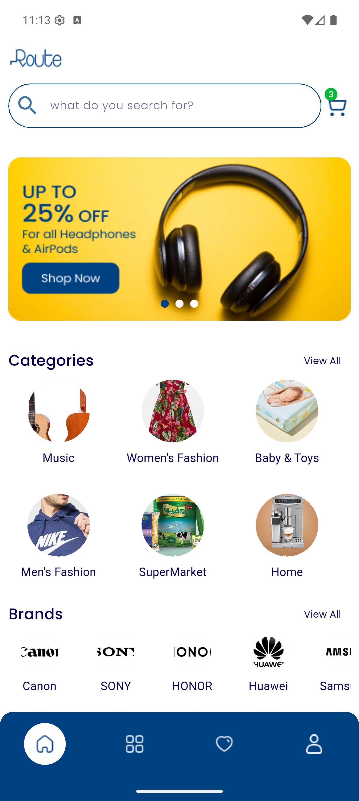
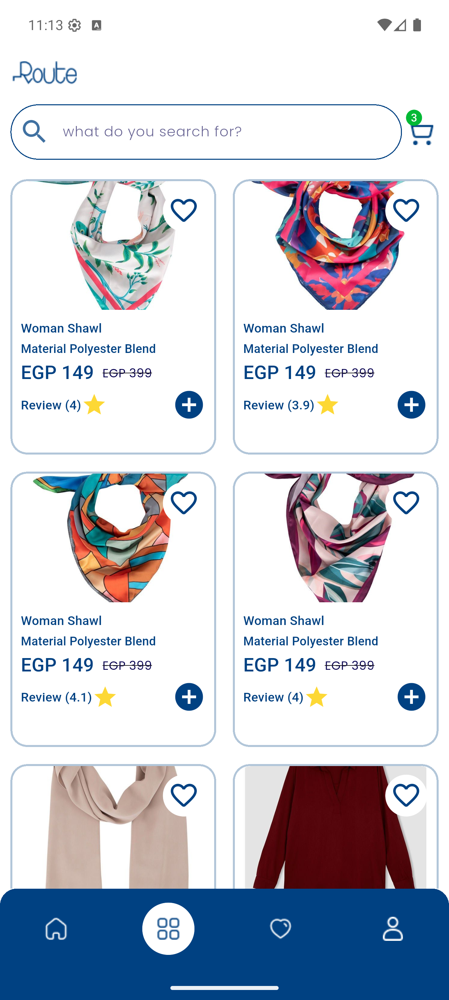
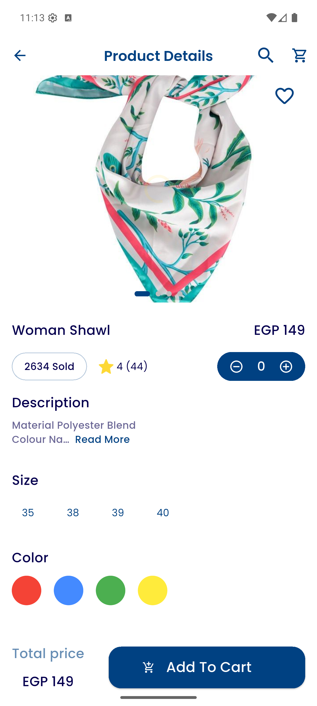
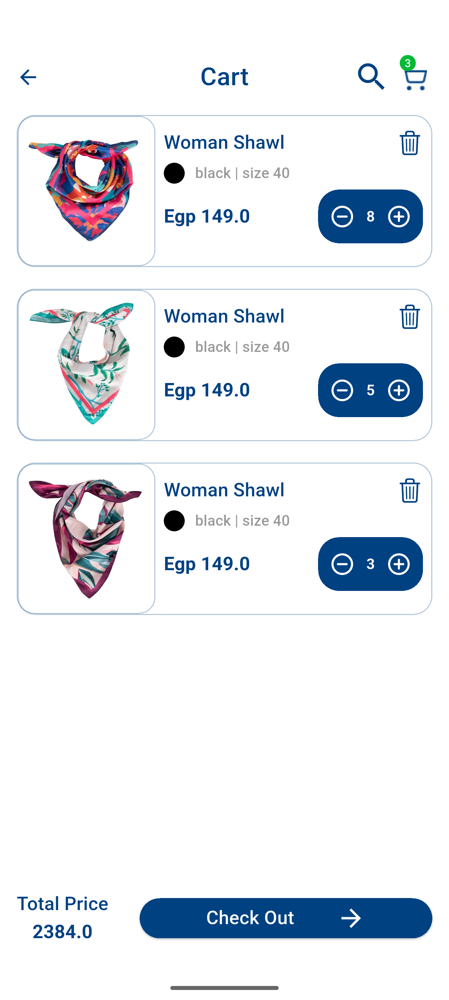
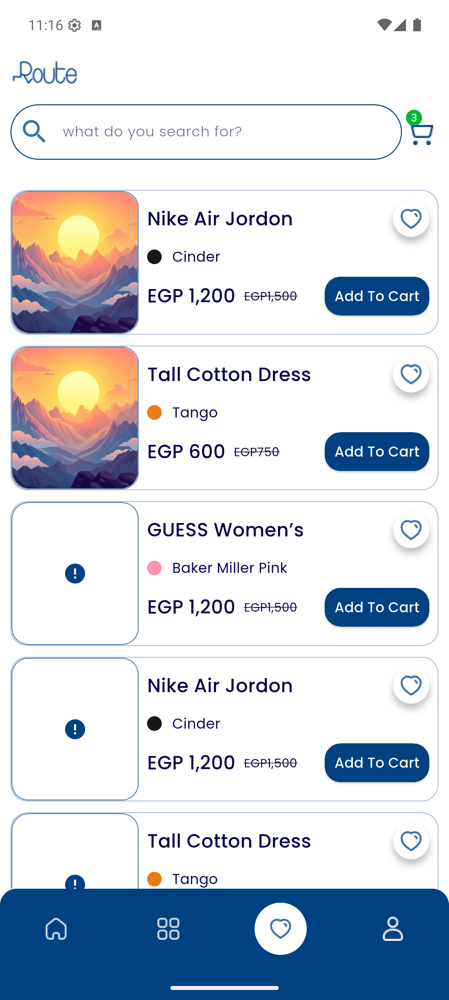
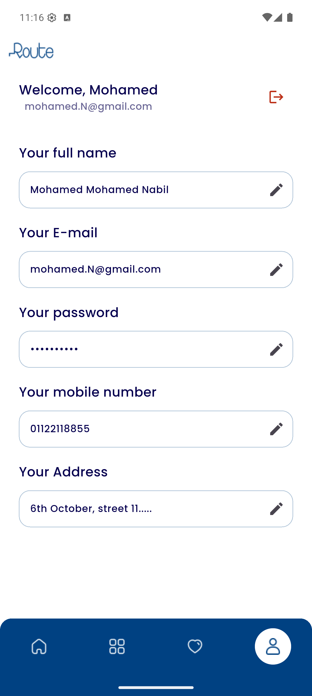
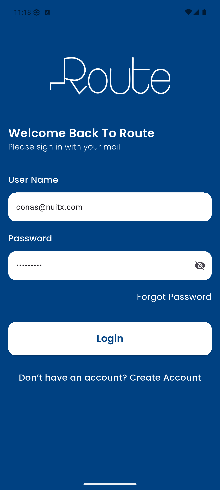
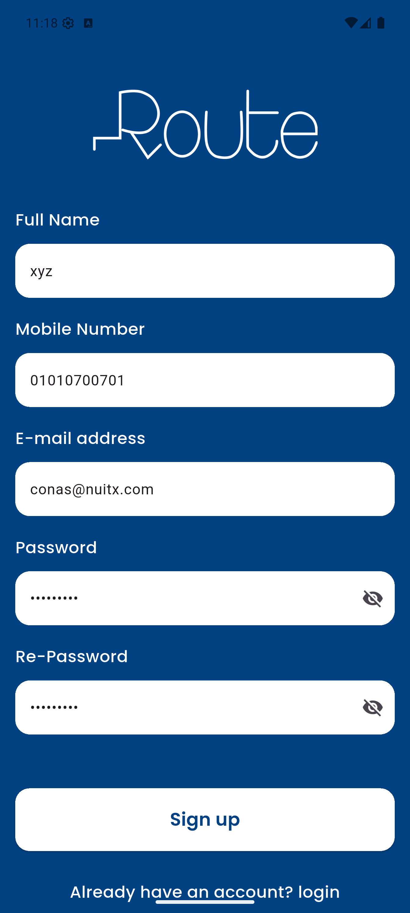

# 🛒 E-Commerce App

<p align="center">
  A production-ready, feature-rich <b>E-Commerce Mobile Application</b> built with <b>Flutter</b> and <b>Clean Architecture</b>.
  <br />
  Powered by <b>BLoC/Cubit</b> state management, <b>Dio</b> networking, and <b>Injectable/GetIt</b> dependency injection.
</p>

<p align="center">
  <a href="https://flutter.dev"></a>
  <a href="https://dart.dev"></a>
  
  
  
  
</p>

---

## 📱 App Screenshots

### 🌟 Core Experience & Catalog
| Home Tab | Product Catalog | Product Details | Shopping Cart |
|:---:|:---:|:---:|:---:|
|  |  |  |  |
| *Banners, Categories & Brands* | *Grid Catalog with Filters & Prices* | *Slider, Size/Color Pickers & Stepper* | *Item Management & Instant Totals* |

### ❤️ Wishlist, Profile & Authentication
| Wishlist / Favorites | User Profile | Login Screen | Registration Screen |
|:---:|:---:|:---:|:---:|
|  |  |  |  |
| *Saved Items with Direct Add* | *Account Info & Secure Logout* | *Secure Sign-In Form* | *Account Creation & Validation* |

---

## ✨ Key Features

- **🔐 Robust Authentication & Session Persistence**:
  - Secure Login and Registration forms with strict client-side validation (`AppValidators`).
  - Persistent session management storing JWT tokens via `SharedPreferences`.
  - Automatic splash routing: seamlessly routes authenticated users directly to `HomeScreen`.

- **🏠 Interactive Discovery & Home Feed**:
  - Auto-sliding promotional banners with custom page indicators.
  - Category showcase with high-res thumbnails.
  - Popular brands slider for curated brand exploration.
  - Persistent custom AppBar containing real-time live cart badge.

- **🛍️ Dynamic Product Catalog**:
  - Staggered two-column product grid with cached network images.
  - Real-time pricing, strike-through discounts, and review ratings.
  - Quick action: toggle items to Wishlist or add directly to Cart from the catalog card.

- **🔍 Comprehensive Product Details**:
  - Multi-image swipeable carousel (`ProductSlider`).
  - Interactive Size selector and dynamic Color palette picker.
  - Incremental quantity stepper (`+` / `-`).
  - Collapsible product overview with `ReadMore` integration.
  - Sticky bottom action bar displaying calculated total price and Add-to-Cart CTA.

- **🛒 Real-Time Cart Management**:
  - Synchronized cart items with live REST backend updates.
  - Dynamic item quantity adjustment and item removal.
  - Instant total computation and formatted price breakdown.
  - Checkout CTA flow.

- **❤️ Wishlist / Favorites**:
  - Dedicated favorites tab to curate loved items.
  - One-tap add-to-cart directly from wishlist entries.

- **👤 User Profile & Account**:
  - Display user information (name, email, mobile, shipping address).
  - In-place editing capability.
  - Graceful session clearance and logout handling.

---

## 🏛️ Architecture & Design Pattern

The application is structured following the principles of **Clean Architecture** and **SOLID Design Principles**, ensuring clear separation of concerns, testability, and maintainability.

### Layer Responsibilities:
1. **Core Layer (`lib/core/`)**: Cross-cutting infrastructure including the Dio REST client (`ApiManager`), endpoint definitions, error/failure models (`Failures`), dependency injection container (`di.dart`), cache helpers (`SharedPrefsUtils`), theme, assets, routes, and shared UI components.
2. **Domain Layer (`lib/domain/`)**: Pure Dart layer completely independent of Flutter frameworks and external libraries. Contains pure business entities, repository contracts (interfaces), and single-responsibility use cases (`LoginUseCase`, `GetAllProductsUseCase`, `AddToCartUseCase`, etc.).
3. **Data Layer (`lib/data/`)**: Implements domain repository contracts. Responsible for network communication via Dio data sources, parsing JSON responses into DTO models, and mapping them into domain entities while handling exceptions and returning `Either<Failures, T>`.
4. **Presentation Layer (`lib/features/ui/`)**: Reusable widgets, responsive screens orchestrated via `flutter_screenutil`, and Cubits/BLoCs emitting states for predictable UI updates.

---

## 📂 Project Directory Structure

```text
ecommerce_app/
├── android/                        # Android platform configurations
├── assets/
│   ├── icons/                      # SVG/PNG icon assets
│   └── images/                     # App branding and placeholder imagery
├── ios/                            # iOS platform configurations
├── lib/
│   ├── core/                       # Shared modules & infrastructure
│   │   ├── api/                    # Dio client, interceptors & endpoints
│   │   ├── cache/                  # SharedPreferences wrapper
│   │   ├── di/                     # Injectable & GetIt configuration
│   │   ├── errors/                 # Domain failures & exception mappers
│   │   └── utils/                  # App colors, themes, styles, routes, constants
│   ├── data/                       # Data layer
│   │   ├── data_sources_impl/      # Remote API data sources implementation
│   │   ├── model/                  # Data Transfer Objects (DTOs) with JSON serialization
│   │   └── repositories_impl/      # Concrete implementations of domain repositories
│   ├── domain/                     # Domain layer (Pure business logic)
│   │   ├── entities/               # Immutable business models
│   │   ├── repositories/           # Abstract repository contracts
│   │   └── use_cases/              # Single-responsibility application use cases
│   ├── features/                   # Feature-driven UI layer
│   │   └── ui/
│   │       ├── auth/               # Login & Register views and Cubits
│   │       ├── pages/              # HomeScreen, CartScreen, ProductDetailsScreen
│   │       └── widgets/            # Custom reusable widgets
│   └── main.dart                   # Application entry point & DI initialization
├── screenshots/                    # High-fidelity mobile screen captures
├── pubspec.yaml                    # Dependencies & asset declarations
└── README.md                       # Project documentation
```

---

## 🛠️ Tech Stack & Key Libraries

| Category | Package / Tool | Purpose |
|---|---|---|
| **Language** | [Dart 3.x](https://dart.dev) | High-performance, null-safe language |
| **Framework** | [Flutter 3.x](https://flutter.dev) | Multiplatform UI toolkit |
| **State Management** | [`flutter_bloc`](https://pub.dev/packages/flutter_bloc) & [`bloc`](https://pub.dev/packages/bloc) | Predictable, event-driven state orchestration |
| **Dependency Injection** | [`get_it`](https://pub.dev/packages/get_it) & [`injectable`](https://pub.dev/packages/injectable) | Compile-time and runtime IoC container |
| **Networking** | [`dio`](https://pub.dev/packages/dio) | Powerful HTTP client with interceptors |
| **Functional Error Handling** | [`dartz`](https://pub.dev/packages/dartz) | Functional programming primitives (`Either<L, R>`) |
| **Screen Responsiveness** | [`flutter_screenutil`](https://pub.dev/packages/flutter_screenutil) | Dynamic viewport adaptation across resolutions |
| **Local Persistence** | [`shared_preferences`](https://pub.dev/packages/shared_preferences) | Key-value store for auth tokens and user preferences |
| **Image Caching** | [`cached_network_image`](https://pub.dev/packages/cached_network_image) | Smooth remote image loading with placeholder/error handling |
| **Sliders & Carousels** | [`carousel_slider_plus`](https://pub.dev/packages/carousel_slider_plus) | Banner and product media sliders |
| **Code Generation** | [`build_runner`](https://pub.dev/packages/build_runner) & [`injectable_generator`](https://pub.dev/packages/injectable_generator) | Automated DI boilerplate generation |

---

## 🚀 Getting Started

### Prerequisites

Ensure you have the following installed on your development machine:
- **Flutter SDK**: `>=3.11.5` ([Install Guide](https://docs.flutter.dev/get-started/install))
- **Dart SDK**: `^3.11.5`
- **Android Studio** / **VS Code** with Flutter and Dart extensions
- An active Android Emulator, iOS Simulator, or physical device

### Installation & Run

1. **Clone the repository**:
   ```bash
   git clone https://github.com/FakhrElddin/ecommer_app.git
   cd ecommerce_app
   ```

2. **Install project dependencies**:
   ```bash
   flutter pub get
   ```

3. **Run code generation** (to generate dependency injection bindings):
   ```bash
   dart run build_runner build --delete-conflicting-outputs
   ```

4. **Launch the application**:
   ```bash
   flutter run
   ```

---

## 📦 Build & Release

To compile production-ready binaries:

- **Android APK**:
  ```bash
  flutter build apk --release
  ```

- **Android App Bundle (for Google Play)**:
  ```bash
  flutter build appbundle --release
  ```

- **iOS IPA (requires macOS)**:
  ```bash
  flutter build ipa --release
  ```

---

## 📝 Code Conventions & Guidelines

- **Clean Architecture Principles**: UI components never communicate directly with data sources; all interactions flow strictly through Use Cases.
- **Custom Widgets Only**: Helper widget-returning methods (e.g. `Widget _buildItem()`) are avoided in favor of dedicated `StatelessWidget` / `StatefulWidget` classes for optimal tree rebuilds.
- **Failures & Errors**: Network and business exceptions are mapped cleanly to `Failures` and handled through functional `Either` returns.
- **Modular Styling**: Centralized styling via `AppColors`, `AppStyles`, and `AppTheme`.
